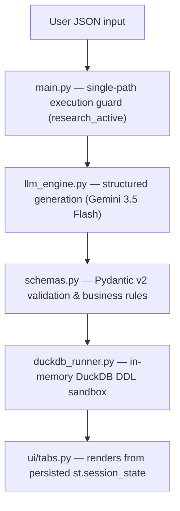

# Data Warehouse Star-Schema Generator

**Raw JSON → Pydantic-validated dimensional model → DuckDB DDL → dbt Core**

[](https://github.com/Ali-datasmith/star-schema-generator)
[](https://streamlit.io/)
[](https://github.com/googleapis/python-genai)
[](https://docs.pydantic.dev/latest/)
[](https://duckdb.org/)
[](https://github.com/Ali-datasmith/star-schema-generator/blob/main/LICENSE)

## Table of Contents

- [🎥 Demo](#-demo)
- [Overview](#overview)
- [Architecture](#architecture)
- [Features](#features)
- [Project Structure](#project-structure)
- [Installation](#installation)
- [Configuration](#configuration)
- [Run](#run)
- [Error Handling](#error-handling)
- [Design Principles](#design-principles)
- [License](#license)
- [Placeholders to Fill](#placeholders-to-fill)

## 🎥 Demo

<!-- LOOM_VIDEO_PLACEHOLDER: paste your Loom share link or iframe embed below this line -->
> 🎬 **Video walkthrough:** _[ Loom demo link coming soon — paste it here ]_

<!-- Optional: when ready, replace the blockquote above with an embed, e.g.
<div style="position: relative; padding-bottom: 56.25%; height: 0;">
  <iframe src="PASTE_YOUR_LOOM_EMBED_URL_HERE" frameborder="0"
    webkitallowfullscreen mozallowfullscreen allowfullscreen
    style="position: absolute; top: 0; left: 0; width: 100%; height: 100%;"></iframe>
</div>
-->

## Overview

Paste in a raw JSON document — an API webhook, an event log, an export blob — and the app returns a fully typed dimensional model: fact table, dimension tables, surrogate keys, natural keys, and foreign-key relationships. Generation happens in a single structured call to Gemini 3.5 Flash, and the result is validated at runtime by Pydantic v2 business-rule contracts rather than brittle JSON-schema constraints.

The generated DDL runs against a real in-memory DuckDB sandbox, so you know it works before you trust it. The app can also emit a matching dbt Core scaffold — staging models, mart models, and a `schema.yml` with tests — so the design drops straight into an analytics-engineering workflow.

It's built to hold up on the free tier: one inference call per run, a deterministic session-state-driven UI, bounded retries only on transient errors, and error messages that are categorized instead of raw stack traces.

## Architecture

Single-call pipeline — one Gemini request in, one validated dimensional model out.

```text
User JSON
   │
   ▼
main.py                  single-path execution guard (research_active)
   │
   ▼
llm_engine.py             structured generation via google-genai SDK
   │                      Gemini 3.5 Flash → response.parsed
   ▼
schemas.py                Pydantic v2 validation
   │                      naming rules, SK/FK integrity, prefixes
   ▼
duckdb_runner.py          in-memory DDL sandbox
   │                      short-circuits on first failing statement
   ▼
ui/tabs.py                state-driven rendering
                           ERD / DDL / dbt / Telemetry tabs
```



## Features

### Single-call structured pipeline

One Gemini request returns a fully typed JSON document, parsed natively into a Pydantic object. No prompt chaining, no manual JSON stitching, no multi-step agent loop.

### LLM-safe Pydantic v2 contracts

Business rules are enforced by Pydantic validators after the response comes back, not by strict JSON-schema keywords baked into the model call:

- `lower_snake_case` naming throughout
- `dim_` / `fct_` table prefixes
- exactly one surrogate key per dimension
- FK ↔ reference consistency
- FK targets must actually exist

Because these rules live in validators rather than the schema passed to the API, structured output generation never trips a `400 INVALID_ARGUMENT` from an over-constrained schema.

### Resilient free-tier execution

- Known-good default model, with optional fallback models
- Works with a default `genai.Client()` when no key is explicitly threaded through
- Prefers `response.parsed` over manual JSON parsing
- Bounded exponential backoff — only on transient errors (timeouts, rate limits), never on auth or validation failures
- Fails fast on auth errors
- Every error is bucketed into a human-readable category: `quota`, `timeout`, `auth`, `not-found`, `validation`

### DuckDB DDL sandbox

Every generated `CREATE TABLE` script runs against a real in-memory DuckDB connection. Execution short-circuits on the first failing statement, giving you an exact point of failure instead of a wall of cascading errors.

### Surrogate-key ownership, unified by construction

The generated DDL is shape-only — no `CREATE SEQUENCE` / `nextval` anywhere. Instead:

- dbt mart models own every surrogate key via `row_number() over (order by <deterministic natural key>)`
- The fact model inherits dimension surrogate keys by joining on natural keys, not by referencing a sequence

The DDL and the dbt models can never disagree about how a key is generated — there's a single source of truth.

### dbt Core generation

- `stg_*` staging models
- `dim_*` / `fct_*` mart models
- a `schema.yml` with `unique`, `not_null`, and `relationships` tests wired to the generated keys

### Single-path execution guard

A `research_active` flag owns the backend lifecycle for a run. All four UI tabs render purely from persisted `st.session_state`, so Streamlit reruns — widget interaction, tab switches — never trigger a duplicate LLM call.

### Interactive blueprint ERD

A custom HTML/SVG renderer (not Plotly) draws the dimensional model with:

- Border-accurate connector lines between tables
- PK / FK / SK / BK chips on each column
- Hover-to-focus path highlighting across relationships
- A sticky title/legend HUD while scrolling the diagram

### Glassmorphism theme

A custom Streamlit theme: a breathing glow on the hero section, a refined sidebar hierarchy with a live-engine status card, and themed metrics, tabs, and code blocks.

### Rich server-side telemetry

Structured, styled console output via Rich, mirrored into an in-app Telemetry tab so you can see what the pipeline did without leaving the browser.

## Project Structure

```text
star-schema-generator/
├── requirements.txt              # Python dependencies: Streamlit, google-genai, Pydantic v2, DuckDB, Rich
├── README.md                     # This file
└── app/
    ├── __init__.py                # Marks app/ as a Python package
    ├── main.py                    # Entry point — single-path execution guard, orchestrates the pipeline
    ├── schemas.py                 # Pydantic v2 models — dimensional contracts + runtime business-rule validators
    ├── services/
    │   ├── __init__.py             # Marks services/ as a Python package
    │   ├── llm_engine.py           # Gemini 3.5 Flash structured generation, retry/backoff, error classification
    │   └── duckdb_runner.py        # Executes generated DDL against an in-memory DuckDB sandbox
    ├── telemetry/
    │   ├── __init__.py             # Marks telemetry/ as a Python package
    │   └── console.py              # Rich-powered server-side logging, mirrored into the Telemetry tab
    ├── ui/
    │   ├── __init__.py             # Marks ui/ as a Python package
    │   ├── theme.py                # Glassmorphism theme, custom CSS, sidebar status card
    │   └── tabs.py                 # State-driven tab rendering (ERD / DDL / dbt / Telemetry)
    └── data/
        └── samples/
            └── stripe_charge_succeeded.json   # Sample input JSON for a quick first run
```

## Installation

Requires Python 3.10+.

```bash
# Clone the repository
git clone https://github.com/Ali-datasmith/star-schema-generator.git
cd star-schema-generator

# Create and activate a virtual environment
python3 -m venv .venv
source .venv/bin/activate      # on Windows: .venv\Scripts\activate

# Install dependencies
pip install -r requirements.txt
```

Works out of the box on Google Colab for experimentation, and deploys directly to Streamlit Community Cloud (free tier) as a hosted app — see [Configuration](#configuration).

## Configuration

The app is driven by a Gemini API key plus a few optional overrides. Never commit real API keys to the repository — use environment variables locally and Streamlit's secrets manager in the cloud.

### Local development

```bash
export GOOGLE_API_KEY="your-gemini-api-key-here"

# Optional overrides
export GEMINI_MODEL="gemini-3.5-flash"
export GEMINI_FALLBACK_MODELS="gemini-3.5-flash-8b,gemini-2.0-flash"
export GEMINI_MAX_OUTPUT_TOKENS="8192"
```

### Streamlit Community Cloud

Create a `.streamlit/secrets.toml` file — keep it git-ignored — or set the equivalent secrets in the Streamlit Cloud dashboard under **Settings → Secrets**:

```toml
# .streamlit/secrets.toml

GOOGLE_API_KEY = "your-gemini-api-key-here"

# Optional
GEMINI_MODEL = "gemini-3.5-flash"
GEMINI_FALLBACK_MODELS = "gemini-3.5-flash-8b,gemini-2.0-flash"
GEMINI_MAX_OUTPUT_TOKENS = "8192"
```

| Variable | Required | Purpose |
|---|---|---|
| `GOOGLE_API_KEY` | Yes | Auth key for the Google GenAI SDK (`google-genai`) |
| `GEMINI_MODEL` | No | Overrides the default known-good model |
| `GEMINI_FALLBACK_MODELS` | No | Comma-separated fallback models if the primary model errors |
| `GEMINI_MAX_OUTPUT_TOKENS` | No | Caps generation length for large or complex JSON inputs |

> Never commit `secrets.toml` or a populated `.env` file. Add both to `.gitignore` before your first commit.

## Run

```bash
streamlit run app/main.py
```

Open the local URL Streamlit prints (typically `http://localhost:8501`), paste in a JSON payload — or use the bundled sample at `app/data/samples/stripe_charge_succeeded.json` — and run the pipeline.

## Error Handling

| Category | Detection | User-Facing Message |
|---|---|---|
| Quota | Rate-limit / quota-exceeded response from the Gemini API | Notice that the quota has been hit, with guidance to wait or check billing limits |
| Timeout | Request exceeds the configured timeout, or a transient network failure | Notice that the request timed out; a bounded-backoff retry has already been attempted |
| Auth | Missing or invalid `GOOGLE_API_KEY`, credential rejection | Fail-fast message asking the user to check their API key — no retry attempted |
| Not Found | Requested model name doesn't exist or is unavailable | Message indicating the model is unavailable, with fallback models surfaced if configured |
| Validation | A Pydantic v2 validator rejects the parsed structured response (naming, key rules, FK consistency) | Clear message naming which business rule failed, with no raw stack trace |

## Design Principles

- **Single inference per execution** — exactly one Gemini call per run; no hidden retries that silently re-spend quota.
- **Deterministic state** — the `research_active` guard is the single source of truth for whether a run is in flight.
- **Schema-first validation** — correctness is enforced by Pydantic v2 validators on the parsed model, not by trusting the LLM's raw output.
- **UI renders from persisted state** — all four tabs read from `st.session_state` only; no tab independently triggers backend work.
- **Explicit execution ownership** — one flag, one owner, one lifecycle.
- **Classified errors, not stack traces** — every failure is bucketed (quota / timeout / auth / not-found / validation) before it reaches the user.
- **Native structured parsing** — `response.parsed` is preferred over manual JSON string parsing wherever the SDK supports it.

## License

Released under the MIT License. See [`LICENSE`](https://github.com/Ali-datasmith/star-schema-generator/blob/main/LICENSE) for details.

## Placeholders to Fill

- [ ] **Loom demo video** — replace the `LOOM_VIDEO_PLACEHOLDER` block above with the real Loom link or embed
<!-- SCREENSHOT_PLACEHOLDER: add app screenshot(s) here — hero view, blueprint ERD, generated DDL, dbt scaffold, Telemetry tab -->